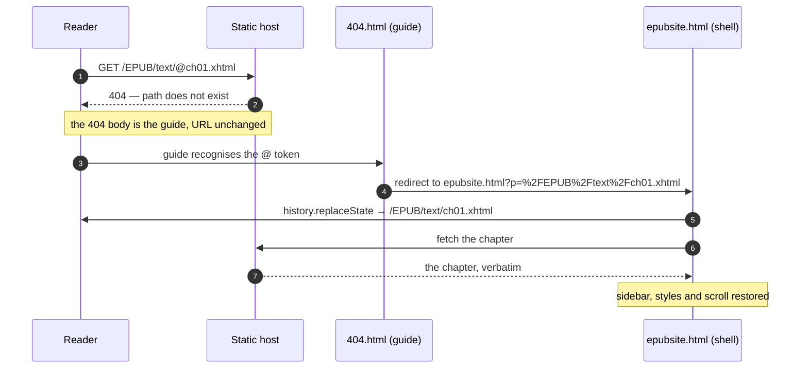

# epubsite

**Publish an EPUB as a real static website — without rewriting a single byte of the book.**

`epubsite` takes an `.epub` file and produces a folder you can drop on any static
host. The book's own files are copied out **verbatim**, at their own paths, with
their own bytes. A reading shell — sidebar, client-side navigation, full-text
search, dark mode — is layered on top from a reserved namespace beside them.

```console
$ npx epubsite childrens-literature.epub
Built 3 chapters, 7 resources (630.0 kB) into ./dist
```

No server, no database, no CDN, no runtime dependencies. Just files.

---


## Install

Requires **Node.js ≥ 20.11**.

```console
# one-off, no install
npx epubsite book.epub

# or install it
npm install --global epubsite
epubsite book.epub
```

Inside this repository, use the bundled script:

```console
npm install
# enable search of on the website
npm run epubsite -- book.epub --search 
# or not
# npm run epubsite -- book.epub
cd dist
# host static website for your epub! (surge is an app help you deploy static website)
surge . https://book-name-of-your-choice.surge.sh/ 

```

---

## Usage

```
epubsite <book.epub> [options]s
epubsite serve [dir]
```

### Quick start

```console
# Build into ./dist
epubsite moby-dick.epub

# Build into a specific directory, wiping it first
epubsite moby-dick.epub -o public --clean

# Preview it locally
epubsite serve public
# → http://127.0.0.1:8080/
```

### Deploying to a subdirectory

If the site will live at `https://example.com/books/moby/`, say so — this is what
makes the reader's assets and links resolve correctly:

```console
epubsite moby-dick.epub --base-url /books/moby/ -o public
```

With a full URL, the build can *also* emit a canonical link, a JSON-LD `url` and
an `og:image`:

```console
epubsite moby-dick.epub --base-url https://example.com/books/moby/
```

A path-only base URL cannot produce those, because it does not know the origin.

### Adding search

```console
epubsite moby-dick.epub --search
```

Search is powered by [Pagefind](https://pagefind.app/). The build looks for the
binary on your `PATH`, then in `node_modules/.bin`, then falls back to `npx`. If
it cannot find it, **the build still succeeds** — it prints a warning, and the
rest of the site is complete and correct:

```
warning W_SEARCH_UNAVAILABLE: the Pagefind binary could not be found; no search
index was generated.
```

Pass `--pagefind ./path/to/pagefind` to point at a specific binary.

Pagefind is deliberately **not** a dependency of this package, and the search
index is built over the spine only — the reader's own pages are never indexed as
part of the book.

### Checking before you write

```console
epubsite moby-dick.epub --dry-run --verbose
```

`--dry-run` validates the book and reports everything it found without touching
the filesystem. `--json` makes the result machine-readable:

```console
epubsite moby-dick.epub --dry-run --json | jq '.stats'
```

### Options

| Option | Default | Description |
|---|---|---|
| `-o, --out <dir>` | `./dist` | Output directory, relative to your shell's cwd. |
| `--name <file>` | `epubsite.html` | Name of the reader shell. Must not be `index.html`. |
| `--base-url <url>` | `/` | Where the site will be deployed. Path form (`/sub/`) or absolute (`https://host/sub/`), which additionally enables canonical, JSON-LD `url` and `og:image`. |
| `--hosting <mode>` | `404` | `none` \| `404` \| `rewrite` \| `all`. See [Hosting](#hosting). |
| `--json-ld <mode>` | `full` | `full` \| `thin` \| `none`. How much Schema.org data to emit. |
| `--no-json-ld` | | Shorthand for `--json-ld none`. |
| `--search` | off | Build a Pagefind full-text index. |
| `--pagefind <path>` | auto | Explicit Pagefind binary. |
| `--no-spa` | | Multi-page site only — do not inject htmx. Every chapter link becomes a normal page load. |
| `--theme <t>` | `auto` | `auto` \| `light` \| `dark`. |
| `--clean` | off | Delete the output directory first. |
| `--force` | off | Write into a non-empty output directory. |
| `--dry-run` | off | Validate and report, but write nothing. |
| `--verbose` | off | Explanatory detail on stderr. |
| `--json` | off | Machine-readable result on stdout. |
| `-h, --help` | | Usage. |
| `-v, --version` | | Version. |

`serve` additionally accepts `--port <n>` (default `8080`; `0` picks a free port).

**Stream discipline:** the build result goes to **stdout**; warnings, errors and
progress go to **stderr**. `epubsite book.epub > result.json` is safe.

---


## Why "zero-rewrite" is the whole point

Most EPUB-to-web converters rewrite the book: they flatten paths, strip the
package document, rewrite every `href`, and hand you back HTML that *resembles*
the book. That is lossy, and it silently breaks anything the converter did not
anticipate — embedded fonts, `xml:lang`, custom CSS, SVG, MathML.

`epubsite` does the opposite. The EPUB is a ZIP; the site is that same directory
tree, extracted. `EPUB/s04.xhtml` becomes `/EPUB/s04.xhtml`. `META-INF/container.xml`,
`mimetype`, the OPF, the NCX — all of it ships, unchanged.

Two consequences follow, and they are the reason this tool exists:

- **Every chapter opens on its own.** `https://example.com/EPUB/ch03.xhtml` is a
  real, working URL. It renders as a bare, readable page with no JavaScript, no
  shell, no build artifacts — because that is literally the file from the EPUB.
  Crawlers, `curl`, and JavaScript-disabled browsers all get the book.
- **Nothing can be broken by the conversion,** because there is no conversion.

The reading experience is added *beside* the book, never *over* it:

```
dist/
├── EPUB/                  ← the book, byte-for-byte
│   ├── package.opf
│   ├── nav.xhtml
│   ├── css/
│   ├── images/
│   └── s04.xhtml          ← also a standalone, working page
├── META-INF/
├── mimetype
│
├── epubsite.html          ┐
├── index.html             │  the reserved namespace:
├── 404.html               │  the reader, its assets and its metadata
├── publication.json       │
├── .epubsite-root         │
└── _epubsite_assets/      ┘
    ├── shell.js
    ├── shell.css
    ├── shell-data.json
    ├── htmx.esm.js
    └── pagefind/          ← only with --search
```

`epubsite` refuses to build (exit 4) if the book already contains a file in that
namespace, rather than silently overwriting part of your book.

---

## Features

| | |
|---|---|
| **Zero-rewrite publishing** | The book is extracted verbatim. Paths, bytes, metadata, fonts and CSS all survive. |
| **Every chapter is a real page** | Deep-linkable, crawlable, works without JavaScript. |
| **Single-page reading experience** | Once you enter the reader, chapter changes swap content in place via htmx — the sidebar never reloads, scroll and focus behave. Degrades to plain multi-page when JS is unavailable. |
| **Sidebar from the book's own navigation** | Uses the EPUB 3 `nav` document, falling back to the NCX. Honours `page-progression-direction` for RTL books. |
| **Per-chapter styles, restored** | Each chapter's own stylesheet links, `@import`s, inline `<style>`, `body` class, `lang` and `dir` are reapplied as you navigate — the book looks the way its publisher intended, chapter by chapter. |
| **Shareable deep links** | A link to `/EPUB/text/@ch01.xhtml` enters the reader at the right chapter, then rewrites the address bar to the honest path. Copy the link button gives a URL that always works. |
| **Full-text search** | `--search` builds a Pagefind index over the spine. Results are highlighted and clicking one stays *inside* the reader. |
| **Structured data** | Schema.org `Book` / `Chapter` JSON-LD, plus a `publication.json` Web Publication Manifest. |
| **Theming** | `auto` / `light` / `dark`, implemented with `light-dark()` and `color-scheme` so it follows the OS and can be overridden. |
| **Fixed-layout books handled honestly** | Pre-paginated EPUBs cannot be reflowed by a shell, so the build degrades to the plain multi-page site and says so on the landing page instead of pretending. |
| **Reference auditing** | The build reports external resources and links that escape the site root, so you know what will break offline. |
| **Strict by design** | Unknown flags are errors. Every failure has a stable exit code and a machine-readable `--json` form. |
| **No lock-in** | The output is plain files. Delete `epubsite.html` and the book is still there, intact. |

---

## How it works

### The reader

`epubsite.html` is the shell. Its head is fully server-rendered — title,
description, canonical, `Book` JSON-LD — so a crawler or a reader with JavaScript
disabled gets a complete, useful document with a table of contents and a landing
page describing the book.

When the runtime loads, it:

1. reads the site root from `document.documentElement.dataset`,
2. absolutizes the shell's own links (a relative asset URL would resolve under a
   chapter's directory after a navigation),
3. loads htmx and the shell data,
4. enters a chapter if the URL asked for one,
5. then, on every navigation, reapplies the chapter's styles, `lang`, `dir`,
   `body` class and JSON-LD, and marks the current sidebar entry.

`hx-boost` handles link interception, with two deliberate exceptions: a link
**within the chapter you are already reading** performs the fragment jump
natively rather than re-requesting the chapter, and external links are left
alone.

### The token protocol: shareable deep links

A reader who lands on `/EPUB/text/ch01.xhtml` directly gets a bare page — correct,
but without the sidebar. To offer a way *into* the reader from an arbitrary
chapter, `epubsite` reserves a parallel addressing scheme: prefix a basename with
`@`.



The URL the reader ends on is the honest one. Copy it, reload it, send it to
someone — it works, with or without the shell.

Without the guide — on a host that does not serve `404.html` for unknown paths —
the `@` form simply 404s; the book's real chapter URLs still work exactly as
before. The token protocol is an enhancement, never a dependency.

### Hosting

| Mode | What you get |
|---|---|
| `none` | Just the files. You handle unknown paths yourself. |
| `404` *(default)* | A `404.html` guide, which is what enables the token protocol on GitHub Pages, Netlify, Cloudflare Pages and similar. |
| `rewrite` | Host-level rewrite rules. **Not implemented** — this is the one documented gap, and it fails with exit 2 rather than emitting rules that look right and are not. |
| `all` | Both. Also fails, for the same reason. |

### Diagnostics

The build reports what it found without stopping, because a book with an external
image is still a book. Warnings and notes go to stderr, above the result:

```console
$ epubsite moby-dick.epub
warning[W_IDENTIFIER_UNPARSEABLE] the book's dc:identifier is not a URN, ISBN or UUID,
so its JSON-LD identity is derived from its text ("urn:epubsite:dfc99ad69255e2c1").
note[external-resource] the book references http://www.gutenberg.org
Built 144 chapters, 10 resources (3.2 MB) into ./dist
```

- **`W_PRE_PAGINATED`** — the book is fixed-layout, so the shell cannot reflow it.
  The site degrades to multi-page and the landing page explains why.
- **`W_IDENTIFIER_UNPARSEABLE`** — the book's identifier is neither an ISBN, a
  UUID nor a URL, so a stable one was derived from its bytes.
- **`W_SEARCH_*`** — search could not be indexed, and why.
- **External resources and out-of-tree links** — reported per chapter, so you can
  see what will fail offline or behind a firewall.

---

## Exit codes

| Code | Meaning |
|---|---|
| `0` | Success. |
| `1` | An unexpected internal error. If you see this, it is a bug. |
| `2` | Usage error, or a documented gap (`--hosting rewrite`). |
| `3` | The input is not a valid EPUB. |
| `4` | A file in the book collides with the reserved namespace, or the output directory is non-empty. |
| `5` | The book contains encrypted content. |

Under `--verbose`, errors print a stack trace. Without it, you get the message and
the location in the book that caused it.

---

## Using it as a library

The CLI is a thin wrapper over a small API:

```ts
import { build } from 'epubsite'

const result = await build('moby-dick.epub', {
  out: 'public',
  baseUrl: { form: 'absolute', href: 'https://example.com/moby/' },
  search: true,
})

console.log(result.stats)              // { chapters, resources, bytes }
console.log(result.diagnostics)
```

`build` throws an `EpubSiteError` carrying a stable `code` and the `exitCode` the
CLI would use. No function in the library calls `process.exit`.

---

## Limitations

These are decisions, not oversights:

- **No path rewriting.** The book keeps its own paths, so a book whose files sit
  in a subdirectory keeps that subdirectory in the URL. This is the price of the
  zero-rewrite guarantee, and it is why the tool exists.
- **No pagination.** The reader scrolls. Paginated reflow requires measuring the
  viewport and rewriting the document's layout, which is exactly the class of
  transformation this tool refuses to perform.
- **No `--book-dir`.** Removed permanently; `--base-url` covers the use case.
- **Fixed-layout books get the multi-page site.** A shell cannot reflow a
  pre-paginated book, and pretending otherwise produces a worse result than being
  honest.
- **Scripts in the book do not execute.** Chapter content is inserted with script
  tags disallowed, so a hosted book cannot run arbitrary code in the reader's
  session.
- **`--hosting rewrite` is not implemented** and fails loudly.

---

## License

MIT — see [LICENSE](LICENSE).

One asset is not MIT: `src/runtime/icon.svg` is a
[Font Awesome Free](https://fontawesome.com) icon, which is **CC BY 4.0**.
Attribution is carried inside the SVG as a leading comment, so it travels with
the image into every generated site, and is restated in
`src/runtime/icon.LICENSE`. The vendored htmx module carries its own licence as
`vendor/htmx.LICENSE`.

---

## Development

```console
npm install
npm run verify        # build + typecheck + lint + unit + integration + browser tests
npm run test          # unit and integration, fast
npm run test:e2e      # Playwright, against real Chrome
npm run epubsite -- <book.epub> --help
```

The browser tests drive the system Chrome (`PLAYWRIGHT_CHANNEL` overrides the
channel). Real-world fixtures come from the
[IDPF EPUB 3 samples](https://idpf.github.io/epub3-samples/30/samples.html); drop
them into `test/fixtures/real/` and they are picked up.

The spec lives in `spec-v1.3.md`. It is the current text; v1.1 and v1.2 are frozen,
and v1.3 preserves their section numbering because the source and tests cite it.
Source is organised by dependency boundary, and that boundary is enforced by lint:

| Path | May use |
|---|---|
| `src/shared/` | nothing — no imports, no `node:` |
| `src/build/` | Node.js. Never the DOM. |
| `src/runtime/` | The DOM. Never Node.js. |
